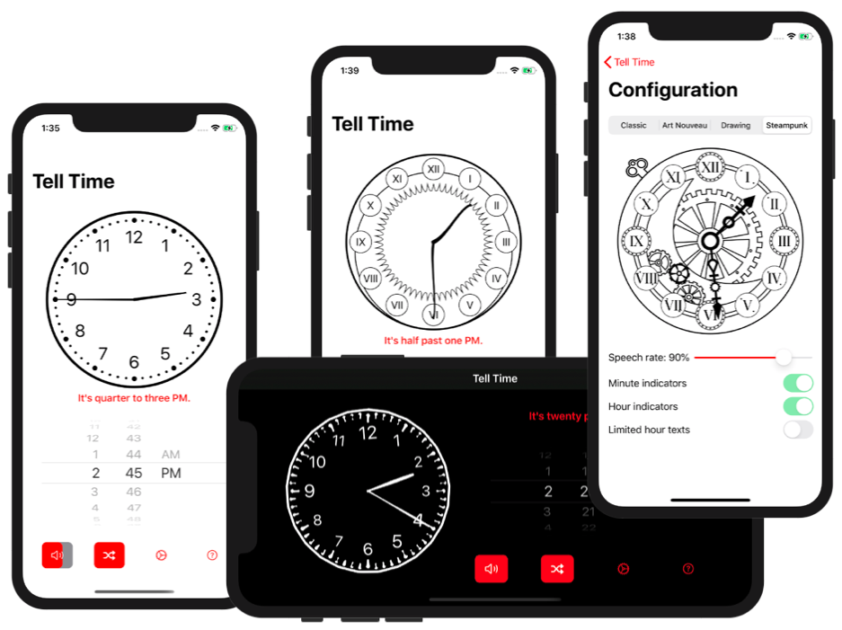

# Tell Time 🇬🇧⏰

>As a French guy in London, when people told me the time, I was always lost. Now thanks to this app, I can confirm what I hear and what I should say to tell the time 😄.

A tiny iOS Swift project with SwiftUI.

📲 App Store: https://apps.apple.com/gb/app/tell-time-uk/id1496541173

## Screenshots

## Features

* 🐰 Time is written in British english, like **It's twenty past seven AM** for 07:20
* ⏰ Nice clock gives you the selected time
* 👆 You can move the clock arms to set the time
* 🕰 Customise the design of the clock (Classic, Art Nouveau or Drawing Style)
* ⏱  Display minute/hour indicators or limited hour as your convenience
* 🗣 Time can be heard with a British accent
* 🐢 You can slow down the spoken utterance in configuration (Speech rate)
* 👂 You can activate the Speech recognition to train your pronunciation.
* 👾 Today Widget gives you the current time

## Icons and illustrations

All artistic work has been made by [Mathilde Seyller](https://instagram.com/myobriel). Go follow her!

## Minimum required to build the project

Works with **Xcode 13.3**.

## Libraries used

* ⏰ [SwiftClockUI](https://github.com/renaudjenny/SwiftClockUI): SwiftUI library that provide the Clock, with draggable arms and different design and options
* 🏠 [The Composable Architecture (TCA)](https://github.com/pointfreeco/swift-composable-architecture): library for helping building apps in a consistent and understandable way. Using two main principles: Single point of truth and unidirectional flow. It's also way more easier to test than any architecture I worked with.
* 🇬🇧 [SwiftPastTen](https://github.com/renaudjenny/SwiftPastTen): Swift framework to provide you the British way to tell the time by passing a "HH:mm" formatted string
* 🇬🇧 [SwiftToTen](https://github.com/renaudjenny/SwiftToTen): Provide useful Swift function to recognize British english time and try converting it to Date
* 🗣 [SwiftTTSCombine](https://github.com/renaudjenny/SwiftTTSCombine): Swift Combine framework to use Text To Speech directly wrapped in Combine way
* 👂 [SwiftSpeechCombine](https://github.com/renaudjenny/SwiftSpeechCombine): Swift Combine framework to use Speech recognition directly wrapped in Combine way
* 📸 [SnapshotTesting](https://github.com/pointfreeco/swift-snapshot-testing): Snapshort testing library from **Point-Free** to test views
